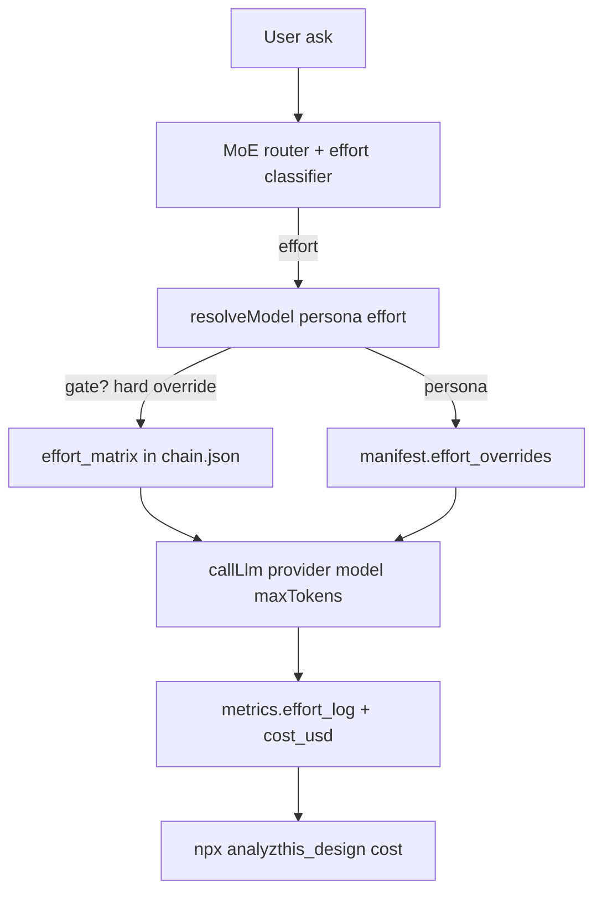

# Analyzthis_Design

A set of AI design personas and a task-first evaluation framework that plugs into Cursor, Claude Code, and Codex CLI as slash commands — plus an agentic MoE router with shared session state so you can call the same graph from any IDE or from the CLI.

Install once. Run structured UX critiques, multi-phase ideation, and task-grounded screen reviews — directly inside your AI chat.

**npm:** [analyzthis_design](https://www.npmjs.com/package/analyzthis_design)

---

## Install

```bash
# Cursor (default)
npx analyzthis_design

# Claude Code
npx analyzthis_design --target claude

# Codex CLI
npx analyzthis_design --target codex

# All three at once
npx analyzthis_design --target all
```

| Tool | Skills installed to |
|---|---|
| Cursor | `~/.cursor/skills/` |
| Claude Code | `~/.claude/commands/` |
| Codex CLI | `~/.codex/skills/` |

---

## Skills Overview

### Entry points (start here)

| Command | What it does |
|---|---|
| `/persona-orchestrator` | **Recommended agentic entry point.** Loads MoE router + session state, runs ux-story-gate intake, executes the right persona chain, enforces DS / hierarchy / verify gates, synthesises a SHIP/REVISE/BLOCK verdict. |
| `/ux-story-gate` | Task-first gate: discovers PRDs, DS/Figma discovery, MoE routing, browser verify, assess-only mode. |
| `/design-critic` | 4-persona critique → `SHIP / REVISE / BLOCK` verdict with a Composite Score out of 20 + Information Hierarchy Gate. |
| `/ux-ideator` | 6-phase ideation → two competing IA concepts, deliberation, delight pass, feasibility check. |

### 7 Individual Personas

Invoke directly for targeted, already-grounded questions. For full screen evaluation, prefer `/persona-orchestrator` or `/ux-story-gate`.

| Command | Persona | What they evaluate |
|---|---|---|
| `/arjun` | UX + Visual Design | UX Honeycomb + Visual Design Audit (hierarchy, color, type, spacing, components, style fit, micro-interactions) |
| `/meera` | Business Agent | Retention, ARR, GTM lever, adoption risk; hierarchy vs north-star check |
| `/priya` | Feasibility Agent | Engineering effort (T-shirt sizing, 2-axis model), state machine traps |
| `/zara` | Delight Agent | Exactly ONE peak delight moment — never contrast/token recovery (routes to DS Gate + Arjun) |
| `/noor` | IA Architect | Minimalist Concept A + declared ranked information hierarchy |
| `/anuj` | Power-User Advocate | Dense Concept B — bulk actions, keyboard shortcuts, hierarchy kept prominent |
| `/raj` | Arbitrator | Resolves persona stalemates using 5 ranked product principles. Never speaks first. |

### Supporting skills

| Command | Purpose |
|---|---|
| `/design-personas` | Session context template — fill in once before a session |
| `/knowledge-bank` | Auto-populated from your connected vault. All personas read this first. |
| `/design-reference` | CSV reference data (colors, typography, UX guidelines, stacks, …) |

---

## Agentic system (v1.10)

```
User ask / Figma URL
        ↓
  /persona-orchestrator
        ↓
  ux-story-gate Phases 0–1.5 (PRD + DS/Figma + MoE router)
        ↓
  MoE subset (default, 1–2 experts) OR design-critic / ideation chain (explicit "full")
        ↓
  Hard gates: DS tokens → Information Hierarchy → Browser verify (skipped if assess_only + no URL)
        ↓
  Session state + cost metrics persisted  →  SHIP / REVISE / BLOCK
```

**Shared session state** lives at `~/.analyzthis_design/sessions/{project-id}/session-state.json` so Ask→Agent turns do not re-derive the task map, DS checklist, or routing decision.

```bash
npx analyzthis_design session init
npx analyzthis_design session show
npx analyzthis_design session reset
```

**Portable agent graph** (same manifests for Cursor / Claude / Codex / CLI):

```
agents/
  manifests/     # one JSON per persona + orchestrator
  router.json    # MoE problem-type → expert list
  chain.json     # default + ideation sequential graphs
  session-schema.json
```

**Standalone runtime (v2):**

```bash
# Print routing only (no API calls)
npx analyzthis_design run --task "Fix contrast on landing page" --dry-run

# Call Anthropic / OpenAI per persona step (MoE subset, lite schema — the default)
export ANTHROPIC_API_KEY=sk-...
npx analyzthis_design run --task "Review this screen" --figma https://figma.com/... --provider anthropic

# Force the full design-critic chain, or bypass the router entirely
npx analyzthis_design run --task "Full critique of onboarding" --full
npx analyzthis_design run --task "Just check spacing" --experts arjun
```

Provider defaults live in `~/.analyzthis_design/config.json`:

```json
{
  "orchestrator": {
    "provider": "anthropic",
    "model": "claude-sonnet-5",
    "mode": "lite",
    "tiers": {
      "structured": { "provider": "openai", "model": "gpt-4o-mini" },
      "critique":   { "provider": "anthropic", "model": "claude-sonnet-5" },
      "arbitrate":  { "provider": "anthropic", "model": "claude-sonnet-5" }
    },
    "max_tokens": { "structured": 900, "critique": 1800, "arbitrate": 1200 }
  },
  "pricing": {
    "glm-4.5-flash":     { "input_per_m": 0,    "output_per_m": 0 },
    "gemini-2.5-flash":  { "input_per_m": 0.30, "output_per_m": 2.50 },
    "claude-sonnet-5":   { "input_per_m": 2,    "output_per_m": 10 },
    "gpt-4o":            { "input_per_m": 2.50, "output_per_m": 10 }
  },
  "research": { "provider": "https://example.com/search?q={query}" }
}
```

The `effort_matrix` and `gate_override` live in `agents/chain.json` (not the user config) so they ship with the package and stay in sync with the agent graph. `pricing` is user-configured so you control your own $-cost reporting.

**Web research:**

```bash
npx analyzthis_design research --url https://example.com/design-tokens
npx analyzthis_design research --query "EY design system tokens"
```

Writes to `~/.analyzthis_design/sessions/{id}/web-context.md` and merges into the knowledge bank on `sync`.

---

## Efficiency & cost (v1.10)

The orchestrator defaults to the cheapest path that still respects every gate — fewer expert calls, shorter prompts, cheaper models where judgment isn't required, and on-disk caching. These savings apply to the **critique/audit** path (what this package does); see *What this actually saves* below for the honest scope.

### Effort-graded model selection (v1.10)

Each persona call is classified **trivial | standard | hard** from cheap signals already in the routing + session digest (no LLM call — a model call to pick a model would eat the savings). The classifier then resolves the model from an effort matrix, with persona-level overrides winning and the legacy `tiers` map as the final fallback so existing manifests keep working unchanged.



Classifier rules (first match wins, safety rules before savings rules):
- scoped mode active → **trivial** (single dimension by construction)
- stalemate / any BLOCK / `full_chain` / `full_screen_review` → **hard**
- `digest.ds_at_risk` non-empty → **hard**
- REVISE delta follow-up → **trivial**
- `manifest.tier == structured` → **trivial**, `arbitrate` → **standard**
- default → **standard**

**Gates never downgrade.** `ds_gate`, `information_hierarchy_gate`, and `verify_gate` are pinned to `hard` via `chain.gate_override` regardless of the classified effort — they're the safety net that makes downgrading persona work safe.

Default effort matrix (in `agents/chain.json`):
- trivial → `glm-4.5-flash` (free) or Gemini Flash-Lite, ~500-token cap
- standard → `gemini-2.5-flash` or `gpt-4o-mini`, ~1200-token cap
- hard → `claude-sonnet-5` or `gpt-5`, ~1800-token cap

Per-persona `effort_overrides` in each manifest refine this (e.g. Arjun's `trivial` is the color-system-only scoped mode at 700 tokens; his `hard` is the full Honeycomb + Visual Audit at 1800).

```
Ask → session digest → MoE router (1–2 experts, not 4) → persona cards (not full skills)
    → retrieve-on-demand CSV rows (not whole files) → model tier by step → caches → cost metrics
```

| Lever | Default behavior |
|---|---|
| **Expert budget** | 1–2 personas per ask. Full `design-critic` chain only runs for an explicit "full critique" or `full_screen_review`. |
| **Early DS exit** | Any "at risk" DS Token Checklist item stops the chain at `arjun_color_system_only` — Meera/Priya/Zara wait until it clears. |
| **Delta re-evaluation** | A follow-up after REVISE re-runs only the personas assigned to the prior Top 3 changes, never the full chain. |
| **Persona cards** | `agents/cards/<persona>.md` (~500 tokens) are the default system prompt; the full `skills/<persona>/SKILL.md` is only opened for a C-or-below rubric lookup or an explicit deep/full request. |
| **Lite output schema** | Grades + Top 2 fixes + score, by default. Deep/full schema is opt-in. |
| **Retrieve-on-demand** | `npx analyzthis_design retrieve --file colors.csv --column "Product Type" --keywords saas` returns only matching rows, pre-formatted for citation — never the whole CSV. |
| **Model tiers** | `structured` steps can run on a cheaper model (e.g. `gpt-4o-mini`); `critique`/`arbitrate` steps use a stronger model. Configurable per tier in `~/.analyzthis_design/config.json`. |
| **Caching** | `lib/cache.js` caches retrieve results (invalidated automatically when the source CSV changes) and knowledge-bank slices (invalidated on `sync` / `session reset`). |
| **Cost metrics** | Every `run` records `metrics` (llm_calls, experts_run, estimated tokens, cache_hits) into session state. |

```bash
npx analyzthis_design metrics                 # last run's cost summary for this project
npx analyzthis_design metrics --all           # across every project
```

### What this actually saves (and what it doesn't)

analyzthis_design is a design **critique** layer, not a design generator. The personas *review* UI; they don't produce a finished design end-to-end. So the savings show up on the **review** side of the loop, and across the **create → review → revise** loop when your host LLM uses the personas as a guided check — not on raw generation in isolation.

**Honest, measurable savings on the critique path:**

- ~50–75% fewer expert LLM calls on narrow asks (1–2 personas vs. 4).
- ~50%+ fewer input tokens per `run` (persona cards vs. full SKILL.md).
- Retrieve-on-demand sends only matching CSV rows, not whole files (`colors.csv` is 32 kB, `styles.csv` is 143 kB — we send ~5 rows).
- Structured/extract steps can run on a cheaper model with a 900-token cap; only critique/arbitrate uses the strong model.
- Repeat runs on the same file hit the cache instead of re-processing Figma screenshots, KB slices, and CSV packs.
- Every saving above is **observable** via `npx analyzthis_design metrics` (`llm_calls`, `input_tokens_est`, `output_tokens_est`, `cache_hits`).

**Where the savings come from across the whole loop** (when the host LLM routes a design through the personas):

- Fewer revision rounds — DS / hierarchy / contrast failures are caught early instead of after a full review.
- Data-driven citations ground the LLM so it doesn't hallucinate or re-derive design rules.
- The host LLM gets a compact digest + targeted fixes, not a wall of prose.

**What this is *not*:**

- It does **not** generate end-to-end designs using fewer tokens — it critiques.
- It does **not** save tokens vs. "using no AI at all" — it adds a review layer; it saves tokens vs. an *unstructured* review loop.
- There is no hard percentage claim yet — v1.9 ships *targets* (full-chain rate <30%, median experts ≤2, ~50% fewer skill-prompt tokens), not proven production numbers. Run `metrics` on your own workload to see your actual savings.

**LoRA readiness (export hook only — no training in this release):**

```bash
npx analyzthis_design session accept --persona arjun     # mark the last output as a good example
npx analyzthis_design export-training --persona arjun --all
```

Writes `{ system_card, digest, user, assistant }` JSONL pairs to `~/.analyzthis_design/training/<persona>.jsonl` from every session where that persona's output was explicitly accepted. Once a persona accumulates ~100–300 accepted pairs, that data is ready for a future fine-tuning pass on an open model — not part of this package yet.

---

## UX Story Gate — How it works

`/ux-story-gate` is the task-first gate for any screen evaluation:

| Phase | What it does |
|---|---|
| 0 | PRD discovery from knowledge bank + repo |
| 0.5 | DS / Figma discovery + DS Token Checklist (exit criteria) |
| 1 | Task map intake gate |
| 1.5 | MoE problem-type router → writes `routing_decision` to session state |
| 2 | Field veto pass |
| 3 | Scale & states declaration |
| 4 | Per-task persona routing |
| 4.5 | Browser verify gate (navigate → snapshot → primary flow → mobile+desktop screenshot) |
| 5 | Task × Finding synthesis |
| 5.5 | Assess-only mode — no code changes until you say build / implement / apply |

---

## Knowledge Bank — Connect your vault

```bash
npx analyzthis_design connect --vault ~/Documents/MyVault
npx analyzthis_design connect --vault ~/vault --tags design,brand,prd,product
npx analyzthis_design connect --vault ~/vault --include Design,Brand,PRDs,Research
npx analyzthis_design sync
npx analyzthis_design sync --target all
npx analyzthis_design status
npx analyzthis_design disconnect --vault ~/Documents/MyVault
```

PRDs and user stories are surfaced at the top of the knowledge bank. Brand / design-system notes feed Phase 0.5. Web research merges under **Web Research Context**.

Config: `~/.analyzthis_design/config.json`.

---

## CLI Reference

```bash
# Install / remove / list
npx analyzthis_design
npx analyzthis_design --target all
npx analyzthis_design --force
npx analyzthis_design remove --target all
npx analyzthis_design list --target all

# Knowledge bank
npx analyzthis_design connect --vault <path> [--tags ...] [--include ...]
npx analyzthis_design sync [--target all]
npx analyzthis_design disconnect --vault <path>
npx analyzthis_design status

# Session (agentic)
npx analyzthis_design session init|show|reset [--project id] [--all]
npx analyzthis_design session accept --persona <id> [--reject]

# Research
npx analyzthis_design research --url <url>
npx analyzthis_design research --query <text>

# Reference data (retrieve-on-demand)
npx analyzthis_design retrieve --file <csv> --column <col> --keywords a,b [--limit N]

# Standalone orchestrator
npx analyzthis_design run --task "..." [--figma URL] [--provider anthropic|openai] [--dry-run] [--output path]
npx analyzthis_design run --task "..." [--lite | --full] [--experts a,b]

# Efficiency / cost
npx analyzthis_design metrics [--project id] [--all]
npx analyzthis_design cost [--project id] [--all]
npx analyzthis_design export-training --persona <id> [--project id] [--all] [--output path]
```

---

## Repository structure

```
agents/                 Portable MoE graph (manifests, router, chain, session schema)
  cards/                Short per-persona system prompts (~500 tokens each)
bin/cli.js              CLI entry point
lib/
  install.js            Skill installation
  knowledge.js          Vault sync + web-context merge
  session.js            Shared session-state.json (+ digest, metrics, accept flag)
  research.js           URL / query → web-context.md
  retrieve.js           Filtered, citation-ready CSV row retrieval
  cache.js              On-disk cache for retrieve/kb slices
  export.js             LoRA training-pair export hook
  cost.js               $-cost report from metrics × config.pricing
  orchestrator/run.js   Standalone LLM runtime (v2) — MoE, effort-graded tiers, caps, cache-aware
scripts/obfuscate.js    Build step → dist/
skills/
  persona-orchestrator/ Agentic entry point
  ux-story-gate/        Task-first gate + DS/MoE/verify/assess phases
  design-critic/        4-persona critique + hierarchy gate
  ux-ideator/           6-phase ideation
  arjun/ meera/ priya/ zara/ noor/ anuj/ raj/
  design-personas/ knowledge-bank/ design-reference/
```

---

## Requirements

- Node.js 16+
- [Cursor](https://cursor.com) with Agent Mode (for `/skill` commands)
- Claude Code or Codex CLI if using those targets
- For `run` (non–dry-run): `ANTHROPIC_API_KEY` or `OPENAI_API_KEY`

---

## License

MIT — [Rishikesh Joshi](https://github.com/rishikeshjoshi)
