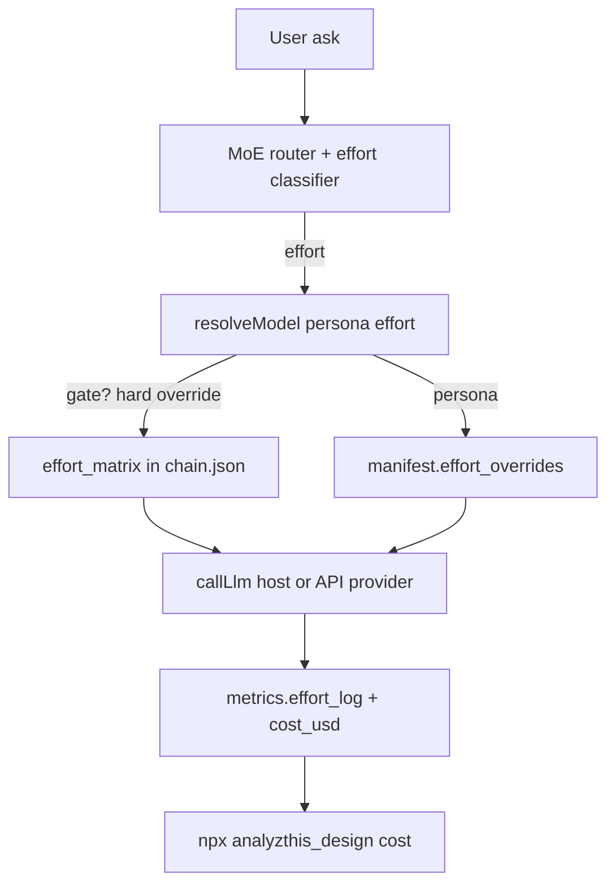

# Analyzthis_Design

A set of AI design personas and a task-first evaluation framework that plugs into Cursor, Claude Code, and Codex CLI as slash commands — plus an agentic MoE router with shared session state so you can call the same graph from any IDE or from the CLI.

Install once. Run structured UX critiques, multi-phase ideation, and task-grounded screen reviews — directly inside your AI chat. **No external LLM API keys required** for CLI orchestrator runs: **`/devi`** voices each persona from your host IDE (Cursor, Claude, etc.).

**npm:** [analyzthis_design](https://www.npmjs.com/package/analyzthis_design) · **Current version:** 1.20.0

---

## Install

```bash
# Cursor (default) + cross-agent path on postinstall
npx analyzthis_design

# Claude Code (skills dir + legacy commands)
npx analyzthis_design --target claude

# Codex CLI
npx analyzthis_design --target codex

# Grok Build (xAI)
npx analyzthis_design --target grok

# Windsurf Cascade
npx analyzthis_design --target windsurf

# All supported hosts at once
npx analyzthis_design --target all --force
```

**After install:** type `/getting-started` in Cursor or Claude Code (or `@getting-started` in Windsurf). Re-print CLI help anytime with `npx analyzthis_design welcome`.

| Tool | Skills installed to | Invoke |
|---|---|---|
| Cursor | `~/.cursor/skills/<name>/SKILL.md` | `/getting-started` |
| Claude Code | `~/.claude/skills/<name>/SKILL.md` (+ legacy `~/.claude/commands/`) | `/getting-started` |
| Codex CLI | `~/.codex/skills/<name>/SKILL.md` | skill name / AGENTS.md |
| Grok Build | `~/.grok/skills/<name>/SKILL.md` | `/kavi` |
| Windsurf Cascade | `~/.codeium/windsurf/skills/<name>/SKILL.md` | `@kavi` |
| Cross-agent | `~/.agents/skills/<name>/SKILL.md` | discovered by multiple hosts |

All skills use the **Agent Skills** `SKILL.md` standard — same files work across Cursor, Claude, Grok, Windsurf, and Codex. The CLI (`collect`, `run`, `sync`) is host-agnostic; only *where skills are discovered* differs.

---

## Skills Overview

### Design — wireframes (start here for new screens)

| Command | What it does |
|---|---|
| `/getting-started` | **First-run guide** — which command to use for wireframes vs critique |
| `/design-director` | **Full producer path** — ideation → DesignSpec (tokens + components) → spec gates → implement when approved |
| `/ux-ideator` | **Full ideation** — two competing text wireframes (minimalist vs dense), deliberation, delight, feasibility, DesignSpec |
| `/design-spec` | **DesignSpec contract** — layout, tokens, component mapping, states (use with design-director) |
| `/noor` | **Quick minimalist wireframe** — Concept A text wireframe, progressive disclosure |
| `/anuj` | **Power-user wireframe** — Concept B text wireframe, density + bulk actions |

### Evaluate — critique (existing designs)

| Command | What it does |
|---|---|
| `/kavi` | **Kavi — Knowledge Archivist.** Scans the codebase, builds an Obsidian vault, LLM-enriches notes, syncs into the knowledge bank. Run once per project before critiques. _(Alias: `/collect-knowledge`)_ |
| `/persona-orchestrator` | **Agentic critique entry point** (not for wireframes). MoE router + session state, ux-story-gate intake, persona chain, DS / hierarchy / verify gates → SHIP/REVISE/BLOCK |
| `/ux-story-gate` | Task-first gate: PRDs, DS/Figma discovery, MoE routing, browser verify, assess-only mode |
| `/design-critic` | 4-persona critique → Composite Score + Information Hierarchy Gate |
| `/deliberation-protocol` | Adversarial review rules — grounding, objection JSON, parallel pairs, Raj escalation |

### 9 Personas (+ host runtime)

Invoke critique personas for targeted, already-grounded questions. For **wireframes**, use `/ux-ideator`, `/noor`, or `/anuj`. For full screen **critique**, prefer `/persona-orchestrator` or `/ux-story-gate`. Run **`/kavi`** first so they have project context.

| Command | Persona | What they evaluate |
|---|---|---|
| `/kavi` | Kavi — Knowledge Archivist | Scan repo → Obsidian vault → enrich → sync knowledge bank (producer, not a critic) |
| `/arjun` | UX + Visual Design | UX Honeycomb + Visual Design Audit (hierarchy, color, type, spacing, components, style fit, micro-interactions) |
| `/meera` | Business Agent | Retention, ARR, GTM lever, adoption risk; hierarchy vs north-star check |
| `/priya` | Feasibility Agent | Engineering effort (T-shirt sizing, 2-axis model), state machine traps |
| `/zara` | Delight Agent | Exactly ONE peak delight moment — never contrast/token recovery (routes to DS Gate + Arjun) |
| `/noor` | IA Architect | Minimalist Concept A + declared ranked information hierarchy |
| `/anuj` | Power-User Advocate | Dense Concept B — bulk actions, keyboard shortcuts, hierarchy kept prominent |
| `/raj` | Arbitrator | Resolves persona stalemates using 5 ranked product principles. Never speaks first. |
| `/devi` | Host LLM runtime | Voices other personas when CLI `run` uses host mode (no API keys). Reads pending prompts → writes responses → `--continue` resumes |

### Supporting skills

| Command | Purpose |
|---|---|
| `/design-personas` | Session context template — fill in once before a session |
| `/knowledge-bank` | Auto-populated from your connected vault (or from Kavi collect). All personas read this first. |
| `/design-reference` | CSV reference data (colors, typography, UX guidelines, stacks, …) |
| `/collect-knowledge` | Alias for `/kavi` |

---

## Agentic system (v1.20)

```
User ask / Figma URL
        ↓
  /persona-orchestrator
        ↓
  ux-story-gate Phases 0–1.5 (PRD + DS/Figma + MoE router)
        ↓
  Adversarial deliberation (parallel objection rounds, low satisfaction default)
        ↓
  MoE subset (default) OR full chain (explicit "full")
        ↓
  Zara (delight) → Raj on stalemate (after all groups — never before Zara)
        ↓
  Phase 5 synthesis (composite score + hierarchy gate + top 3)
        ↓
  Hard gates: DS → Hierarchy → Verify
        ↓
  SHIP / REVISE / BLOCK
```

### Devi — host LLM (no API keys) · v1.20

When no `OPENAI_API_KEY` / `ANTHROPIC_API_KEY` / `GEMINI_API_KEY` / `ZAI_API_KEY` is set, **`run` defaults to `provider: host`**. The orchestrator writes each persona step as a prompt file; **`/devi`** (or your host IDE agent) embodies that persona and writes the response back. No paid API calls.

```bash
# 1. Start run — pauses at first persona with prompt path
npx analyzthis_design run --task "Review invoice approval screen" --full

# 2. In Cursor / Claude: invoke /devi
#    (reads pending/*.json, writes responses/*.md in persona voice)

# 3. Check queue + continue
npx analyzthis_design devi status
npx analyzthis_design run --continue --task "Review invoice approval screen" --full
```

**Prompt queue layout:**

```
~/.analyzthis_design/runs/{project-id}/{run-id}/
  pending/001-arjun.json    ← orchestrator writes
  responses/001-arjun.md    ← Devi / host IDE writes
  manifest.json
```

**Submit a response manually:**

```bash
npx analyzthis_design devi respond \
  --run ~/.analyzthis_design/runs/{project-id}/{run-id} \
  --step 001-arjun \
  --file my-arjun-response.md
```

**Override host mode** when you have API keys:

```bash
export ANTHROPIC_API_KEY=sk-...
npx analyzthis_design run --task "..." --provider anthropic
```

Skill: `/devi` · Implementation: `lib/host-llm.js`, `lib/provider.js`

### Phase 5 synthesis · v1.20

After deliberation closes, the orchestrator builds a **composite synthesis** automatically:

- Per-persona scores (Arjun, Meera, Priya, Zara)
- **Verdict:** SHIP / REVISE / BLOCK
- **Top 3 actionable changes** (ranked)
- **Information Hierarchy Gate** (Arjun visual hierarchy + Meera hierarchy check)

Stored in session as `synthesis` (JSON) and `synthesis_markdown` (display block). Printed at end of every completed `run`.

### Adversarial deliberation (v1.19+)

Personas **debate** grounded in real task_map, PRD, and UI context — they do not pass generic handoff documents.

| Knob | Default | Meaning |
|------|---------|---------|
| `satisfaction_threshold` | 0.4 | Personas hard to please — must see evidence before `accepts_prior: true` |
| `max_rounds` | 3 | Cap on objection rounds (token-bounded) |
| `parallel_pairs` | Noor∥Anuj, Meera∥Priya | Adversarial critique in parallel |

```bash
npx analyzthis_design run --task "Review onboarding" --full --dry-run   # see deliberation groups
npx analyzthis_design run --task "..." --satisfaction 0.3               # even harder to satisfy
npx analyzthis_design run --task "..." --no-deliberate                  # legacy sequential mode
npx analyzthis_design metrics                                           # deliberation_rounds, objections
```

Config: `~/.analyzthis_design/config.json` → `deliberation` block (see `supabase/deliberation-config.example.json`).

Skill: `/deliberation-protocol` | Schema: `agents/deliberation-schema.json`

**Low satisfaction ≠ unlimited tokens.** Objection rounds use lite schema + 600-token cap; synthesis and Raj use full produce mode.

**Raj order (v1.20):** Raj escalates **after all deliberation groups** complete — Zara always runs before Raj in the critique chain.

---

**Shared session state** lives at `~/.analyzthis_design/sessions/{project-id}/session-state.json`.

Key fields after a run:

| Field | Contents |
|---|---|
| `persona_outputs` | Each persona's text + parsed deliberation JSON |
| `deliberation` | `round_log`, `open_objections`, `consensus_reached`, `raj_escalated` |
| `synthesis` | Composite scores, verdict, top 3, hierarchy gate |
| `synthesis_markdown` | Phase 5 block for display / export |
| `host_run` | Host-mode checkpoint when paused for Devi (`run_dir`, `checkpoint`) |
| `metrics` | `llm_calls`, `deliberation_rounds`, `objections_raised`, token estimates |

```bash
npx analyzthis_design session init
npx analyzthis_design session show
npx analyzthis_design session reset
```

**Portable agent graph** (same manifests for Cursor / Claude / Codex / CLI):

```
agents/
  manifests/     # one JSON per persona + orchestrator
  router.json    # MoE problem-type → expert list
  chain.json     # default + ideation sequential graphs
  session-schema.json
```

**Standalone runtime (v2):**

```bash
# Print routing + deliberation groups (no LLM calls)
npx analyzthis_design run --task "Fix contrast on landing page" --dry-run

# Host mode (default when no API keys) — Devi voices personas
npx analyzthis_design run --task "Review invoice screen" --full
npx analyzthis_design devi status
npx analyzthis_design run --continue --task "Review invoice screen" --full

# External API providers (optional)
export ANTHROPIC_API_KEY=sk-...
npx analyzthis_design run --task "Review this screen" --figma https://figma.com/... --provider anthropic

# Force full chain, bypass router, tune deliberation
npx analyzthis_design run --task "Full critique of onboarding" --full
npx analyzthis_design run --task "Just check spacing" --experts arjun
npx analyzthis_design run --task "..." --max-rounds 2 --satisfaction 0.5
npx analyzthis_design run --task "..." --no-deliberate   # legacy sequential handoff
```

**Provider resolution order:** explicit `--provider` → config → first available API key → **`host`** (Devi).

Supported providers: `host` | `anthropic` | `openai` | `google` | `zai`

Provider defaults live in `~/.analyzthis_design/config.json`:

```json
{
  "orchestrator": {
    "provider": "anthropic",
    "model": "claude-sonnet-5",
    "mode": "lite",
    "tiers": {
      "structured": { "provider": "openai", "model": "gpt-4o-mini" },
      "critique":   { "provider": "anthropic", "model": "claude-sonnet-5" },
      "arbitrate":  { "provider": "anthropic", "model": "claude-sonnet-5" }
    },
    "max_tokens": { "structured": 900, "critique": 1800, "arbitrate": 1200 }
  },
  "pricing": {
    "glm-4.5-flash":     { "input_per_m": 0,    "output_per_m": 0 },
    "gemini-2.5-flash":  { "input_per_m": 0.30, "output_per_m": 2.50 },
    "claude-sonnet-5":   { "input_per_m": 2,    "output_per_m": 10 },
    "gpt-4o":            { "input_per_m": 2.50, "output_per_m": 10 }
  },
  "research": { "provider": "https://example.com/search?q={query}" },
  "collect": {
    "web_urls": ["https://your-company.com/brand-guidelines"],
    "web_queries": ["competitor onboarding patterns"],
    "web_limit": 10,
    "web_from_repo": true
  }
}
```

The `effort_matrix` and `gate_override` live in `agents/chain.json` (not the user config) so they ship with the package and stay in sync with the agent graph. `pricing` is user-configured so you control your own $-cost reporting.

**Web research (automatic in collect):**

Kavi fetches URLs during `collect` — from config and from links in README/PRD markdown — and merges them into the knowledge bank. You usually do **not** need a separate `research` step.

```bash
npx analyzthis_design collect                    # repo + web URLs in one pass
npx analyzthis_design collect --dry-run          # preview URLs Kavi will fetch
npx analyzthis_design collect --no-web           # repo only
```

Manual research (optional, when you want one-off fetches without a full collect):

```bash
npx analyzthis_design research --url https://example.com/design-tokens
npx analyzthis_design research --query "EY design system tokens"
```

Writes to `~/.analyzthis_design/sessions/{id}/web-context.md` and merges into the knowledge bank on `sync` / `collect`.

---

## Efficiency & cost (v1.10)

The orchestrator defaults to the cheapest path that still respects every gate — fewer expert calls, shorter prompts, cheaper models where judgment isn't required, and on-disk caching. These savings apply to the **critique/audit** path (what this package does); see *What this actually saves* below for the honest scope.

### Effort-graded model selection (v1.10)

Each persona call is classified **trivial | standard | hard** from cheap signals already in the routing + session digest (no LLM call — a model call to pick a model would eat the savings). The classifier then resolves the model from an effort matrix, with persona-level overrides winning and the legacy `tiers` map as the final fallback so existing manifests keep working unchanged.



Classifier rules (first match wins, safety rules before savings rules):
- scoped mode active → **trivial** (single dimension by construction)
- stalemate / any BLOCK / `full_chain` / `full_screen_review` → **hard**
- `digest.ds_at_risk` non-empty → **hard**
- REVISE delta follow-up → **trivial**
- `manifest.tier == structured` → **trivial**, `arbitrate` → **standard**
- default → **standard**

**Gates never downgrade.** `ds_gate`, `information_hierarchy_gate`, and `verify_gate` are pinned to `hard` via `chain.gate_override` regardless of the classified effort — they're the safety net that makes downgrading persona work safe.

Default effort matrix (in `agents/chain.json`):
- **trivial** → `host` / Devi (~600-token cap for objection rounds) — or API model when keys set
- **standard** → `gemini-2.5-flash` or `gpt-4o-mini`, ~1200-token cap
- **hard** → `claude-sonnet-5` or `gpt-5`, ~1800-token cap

Per-persona `effort_overrides` in each manifest refine this (e.g. Arjun's `trivial` is the color-system-only scoped mode at 700 tokens; his `hard` is the full Honeycomb + Visual Audit at 1800).

```
Ask → session digest → MoE router (1–2 experts, not 4) → persona cards (not full skills)
    → retrieve-on-demand CSV rows (not whole files) → model tier by step → caches → cost metrics
```

| Lever | Default behavior |
|---|---|
| **Expert budget** | 1–2 personas per ask. Full `design-critic` chain only runs for an explicit "full critique" or `full_screen_review`. |
| **Early DS exit** | Any "at risk" DS Token Checklist item stops the chain at `arjun_color_system_only` — Meera/Priya/Zara wait until it clears. |
| **Delta re-evaluation** | A follow-up after REVISE re-runs only the personas assigned to the prior Top 3 changes, never the full chain. |
| **Persona cards** | `agents/cards/<persona>.md` (~500 tokens) are the default system prompt; the full `skills/<persona>/SKILL.md` is only opened for a C-or-below rubric lookup or an explicit deep/full request. |
| **Lite output schema** | Grades + Top 2 fixes + score, by default. Deep/full schema is opt-in. |
| **Retrieve-on-demand** | `npx analyzthis_design retrieve --file colors.csv --column "Product Type" --keywords saas` returns only matching rows, pre-formatted for citation — never the whole CSV. |
| **Model tiers** | `structured` steps can run on a cheaper model (e.g. `gpt-4o-mini`); `critique`/`arbitrate` steps use a stronger model. Configurable per tier in `~/.analyzthis_design/config.json`. |
| **Caching** | `lib/cache.js` caches retrieve results (invalidated automatically when the source CSV changes) and knowledge-bank slices (invalidated on `sync` / `session reset`). |
| **Cost metrics** | Every `run` records `metrics` (llm_calls, experts_run, estimated tokens, cache_hits) into session state. |

```bash
npx analyzthis_design metrics                 # last run's cost summary for this project
npx analyzthis_design metrics --all           # across every project
```

### What this actually saves (and what it doesn't)

analyzthis_design is a design **critique** layer, not a design generator. The personas *review* UI; they don't produce a finished design end-to-end. So the savings show up on the **review** side of the loop, and across the **create → review → revise** loop when your host LLM uses the personas as a guided check — not on raw generation in isolation.

**Honest, measurable savings on the critique path:**

- ~50–75% fewer expert LLM calls on narrow asks (1–2 personas vs. 4).
- ~50%+ fewer input tokens per `run` (persona cards vs. full SKILL.md).
- Retrieve-on-demand sends only matching CSV rows, not whole files (`colors.csv` is 32 kB, `styles.csv` is 143 kB — we send ~5 rows).
- Structured/extract steps can run on a cheaper model with a 900-token cap; only critique/arbitrate uses the strong model.
- Repeat runs on the same file hit the cache instead of re-processing Figma screenshots, KB slices, and CSV packs.
- Every saving above is **observable** via `npx analyzthis_design metrics` (`llm_calls`, `input_tokens_est`, `output_tokens_est`, `cache_hits`).

**Where the savings come from across the whole loop** (when the host LLM routes a design through the personas):

- Fewer revision rounds — DS / hierarchy / contrast failures are caught early instead of after a full review.
- Data-driven citations ground the LLM so it doesn't hallucinate or re-derive design rules.
- The host LLM gets a compact digest + targeted fixes, not a wall of prose.

**What this is *not*:**

- It does **not** generate end-to-end designs using fewer tokens — it critiques.
- It does **not** save tokens vs. "using no AI at all" — it adds a review layer; it saves tokens vs. an *unstructured* review loop.
- There is no hard percentage claim yet — v1.9 ships *targets* (full-chain rate <30%, median experts ≤2, ~50% fewer skill-prompt tokens), not proven production numbers. Run `metrics` on your own workload to see your actual savings.

**LoRA readiness (export hook only — no training in this release):**

```bash
# Good examples (positive pairs)
npx analyzthis_design session accept --persona arjun
npx analyzthis_design export-training --persona arjun --all

# Bad output + how you corrected it (negative / DPO pairs) — v1.16
npx analyzthis_design session accept --persona arjun --reject \
  --comment "Invented tokens not in our DS" \
  --correction "Use --color-primary and spacing-4 from tokens.css" \
  --rating 2 --tags invented_tokens,missed_ds

npx analyzthis_design feedback record --persona arjun --rating 2 \
  --comment "Hierarchy wrong — CTA buried" \
  --correction "Primary action should be top-right, above the fold"

npx analyzthis_design feedback list
npx analyzthis_design feedback export --persona arjun --all
```

Writes `{ system_card, digest, user, assistant }` JSONL pairs to `~/.analyzthis_design/training/<persona>.jsonl` from every session where that persona's output was explicitly accepted.

**Correction export** writes `{ assistant_rejected, assistant_preferred, user_comment, tags }` to `~/.analyzthis_design/feedback/<persona>-corrections.jsonl` — useful when users were unhappy or had to rewrite persona output. Every entry is also appended to a global `corrections.jsonl` across projects.

Once a persona accumulates ~100–300 accepted pairs (and optionally correction pairs), that data is ready for a future fine-tuning pass on an open model — not part of this package yet.

---

## Persona feedback — corrections & unhappiness (v1.16)

When a persona gets it wrong, you can record **what was wrong** and **how you fixed it**. This feeds future fine-tuning (negative / DPO pairs) alongside the existing positive `export-training` path.

| Command | Purpose |
|---------|---------|
| `feedback record` | Log rating, comment, correction, tags for a persona's last output |
| `feedback list` | See all feedback for this project (or `--all`) |
| `feedback export` | Write `{ assistant_rejected, assistant_preferred, … }` JSONL |
| `session accept --reject --comment …` | Reject + record in one step |

Suggested tags: `wrong_hierarchy`, `invented_tokens`, `missed_ds`, `too_verbose`, `bad_ia`, `off_brief`.

Stored in `session-state.json` → `feedback_log` and appended globally to `~/.analyzthis_design/feedback/corrections.jsonl`.

### Community collection (v1.17) — opt-in submit

For **open-source contributors**, share anonymized corrections with maintainers:

```bash
npx analyzthis_design feedback record --persona arjun --rating 2 --comment "..." --correction "..."
npx analyzthis_design feedback submit --dry-run    # preview redacted payload
npx analyzthis_design feedback submit --all --yes  # send unsent entries (asks consent once)
npx analyzthis_design feedback status
```

**What gets sent:** persona, rating, tags, comment, correction, redacted output snippets, anonymous install id, package version.

**What does NOT get sent:** project paths, repo names, emails, API keys, full source trees.

**Maintainer setup (Supabase):**

1. Create a Supabase project
2. Run `supabase/migrations/001_persona_feedback.sql` in the SQL editor
3. Copy `supabase/feedback-config.example.json` into `~/.analyzthis_design/config.json` under `"feedback"` (or set env vars `ANALYZTHIS_FEEDBACK_URL` + `ANALYZTHIS_FEEDBACK_ANON_KEY`)
4. View submissions in Supabase Table Editor → `persona_feedback`

Users can also file GitHub issues via **Persona feedback** template if they prefer not to use CLI submit.

---

## DesignSpec — Designer-grade handoff (v1.15)

Personas can now guide **what** and **how** to design — not just critique.

```
/ux-ideator or /design-director
        ↓
  Text wireframe + information hierarchy
        ↓
  DesignSpec JSON (layout, tokens, components, states)
        ↓
  Spec gates: DS + hierarchy + Arjun visual
        ↓
  status: ship → implement (if build_approved)
        ↓
  Browser verify + delta critique
```

**DesignSpec** fields: `intent`, `information_hierarchy`, `layout.regions`, `tokens` (from your DS), `components[]` (real import paths), `states` (empty/loading/error/success), `do`/`dont`.

```bash
npx analyzthis_design spec template    # empty copy-paste block
npx analyzthis_design spec validate --file design-spec.json
npx analyzthis_design spec save --file design-spec.json
npx analyzthis_design spec show
```

Schema: `agents/design-spec-schema.json`. Producer orchestration: `/design-director`.

---

## UX Story Gate — How it works

`/ux-story-gate` is the task-first gate for any screen evaluation:

| Phase | What it does |
|---|---|
| 0 | PRD discovery from knowledge bank + repo |
| 0.5 | DS / Figma discovery + DS Token Checklist (exit criteria) |
| 1 | Task map intake gate |
| 1.5 | MoE problem-type router → writes `routing_decision` to session state |
| 2 | Field veto pass |
| 3 | Scale & states declaration |
| 4 | Per-task persona routing |
| 4.5 | Browser verify gate (navigate → snapshot → primary flow → mobile+desktop screenshot) |
| 5 | Task × Finding synthesis |
| 5.5 | Assess-only mode — no code changes until you say build / implement / apply |

---

## Knowledge collection — Kavi (v1.14)

Kavi is a **producer** persona (not a critic). One command scans the current repo, **discovers Obsidian vaults and knowledge graphs**, **fetches external URLs**, writes an Obsidian vault with dynamic `Sources/*.md` manifests, optionally enriches notes, then auto-connects and syncs everything into the knowledge bank.

```
/kavi  (or  npx analyzthis_design collect)
        ↓
  Scan codebase → draft Obsidian notes
        ↓
  Discover knowledge sources (.obsidian vaults, wikis, refs in README/docs)
        ↓
  Write Sources/*.md manifest notes + _meta/knowledge-sources.md
        ↓
  Auto-connect discovered vaults + fetch web URLs → web-context.md
        ↓
  LLM enrich (optional)
        ↓
  connect + sync → knowledge bank (repo + vaults + web)
        ↓
  Personas read unified context first
```

```bash
# In your app repo (sync KB to every host):
npx analyzthis_design collect --target all
npx analyzthis_design collect --dry-run          # preview notes + URLs
npx analyzthis_design collect --no-web           # skip external fetch
npx analyzthis_design collect --no-enrich --limit 50
npx analyzthis_design collect --vault ~/Documents/MyProjectVault --target claude
```

Add external sources and vault paths in `~/.analyzthis_design/config.json`:

```json
{
  "collect": {
    "source_paths": ["~/Documents/MyCompanyVault"],
    "scan_home_vaults": false,
    "auto_connect_discovered": true,
    "web_urls": ["https://your-company.com/brand-guidelines"],
    "web_limit": 10
  }
}
```

Kavi auto-discovers: `.obsidian/` vaults in the repo, markdown wikis, knowledge-graph mentions, and vault paths referenced in README / AGENTS.md / docs. Each discovery gets a `Sources/*.md` manifest note fed into the knowledge bank.

Vault folders: `PRDs/`, `Brand/`, `Product/`, `Pages/`, `Components/`, `Design/`, `Tech/`, `Research/`, `_meta/`. Notes use YAML frontmatter + `[[wikilinks]]`. Re-runs skip unchanged enriched notes via content hash.

Enrichment needs one of: `OPENAI_API_KEY`, `GEMINI_API_KEY`, `ANTHROPIC_API_KEY`, `ZAI_API_KEY`. Without a key, Kavi still writes a draft vault and syncs it.

---

## Knowledge Bank — Connect your vault

```bash
# Option A — let Kavi build the vault from the codebase (recommended for new projects)
npx analyzthis_design collect

# Option B — connect an existing Obsidian vault or markdown folder
npx analyzthis_design connect --vault ~/Documents/MyVault
npx analyzthis_design connect --vault ~/vault --tags design,brand,prd,product
npx analyzthis_design connect --vault ~/vault --include Design,Brand,PRDs,Research
npx analyzthis_design sync
npx analyzthis_design sync --target all
npx analyzthis_design status
npx analyzthis_design disconnect --vault ~/Documents/MyVault
```

PRDs and user stories are surfaced at the top of the knowledge bank. Brand / design-system notes feed Phase 0.5. Web research merges under **Web Research Context**.

Config: `~/.analyzthis_design/config.json`.

---

## CLI Reference

```bash
# Install / remove / list / welcome
npx analyzthis_design
npx analyzthis_design --target all
npx analyzthis_design --force
npx analyzthis_design welcome [--target cursor|claude|all]
npx analyzthis_design remove --target all
npx analyzthis_design list --target all

# Design spec
npx analyzthis_design spec template
npx analyzthis_design spec validate --file design-spec.json
npx analyzthis_design spec save --file design-spec.json
npx analyzthis_design spec show

# Knowledge collection (Kavi)
npx analyzthis_design collect [--vault path] [--dry-run] [--no-enrich] [--no-web] [--no-discover] [--web-limit N] [--target ...]

# Knowledge bank
npx analyzthis_design connect --vault <path> [--tags ...] [--include ...]
npx analyzthis_design sync [--target all]
npx analyzthis_design disconnect --vault <path>
npx analyzthis_design status

# Session (agentic)
npx analyzthis_design session init|show|reset [--project id] [--all]
npx analyzthis_design session accept --persona <id> [--reject] [--comment "..."] [--correction "..."] [--rating 1-5] [--tags a,b]

# Persona feedback (v1.16)
npx analyzthis_design feedback record --persona <id> [--rating 1-5] [--comment "..."] [--correction "..."] [--tags a,b]
npx analyzthis_design feedback list [--all]
npx analyzthis_design feedback export [--persona <id>] [--all] [--output path] [--include-positive]
npx analyzthis_design feedback submit [--persona <id>] [--all] [--yes] [--dry-run]
npx analyzthis_design feedback status
npx analyzthis_design feedback revoke

# Research
npx analyzthis_design research --url <url>
npx analyzthis_design research --query <text>

# Reference data (retrieve-on-demand)
npx analyzthis_design retrieve --file <csv> --column <col> --keywords a,b [--limit N]

# Standalone orchestrator
npx analyzthis_design run --task "..." [--figma URL] [--provider host|anthropic|openai|google|zai] [--dry-run] [--output path]
npx analyzthis_design run --task "..." [--lite | --full] [--experts a,b]
npx analyzthis_design run --task "..." [--deliberate | --no-deliberate] [--max-rounds N] [--satisfaction 0.4]
npx analyzthis_design run --continue --task "..."   # resume host-mode run after /devi

# Devi — host LLM queue (v1.20)
npx analyzthis_design devi status [--run path]
npx analyzthis_design devi respond --run <run-dir> --step 001-arjun --file response.md

# Efficiency / cost
npx analyzthis_design metrics [--project id] [--all]
npx analyzthis_design cost [--project id] [--all]
npx analyzthis_design export-training --persona <id> [--project id] [--all] [--output path]
npx analyzthis_design feedback export [--persona <id>] [--project id] [--all] [--output path]
```

---

## Repository structure

```
agents/                 Portable MoE graph (manifests, router, chain, session schema)
  cards/                Short per-persona system prompts (~500 tokens each)
bin/cli.js              CLI entry point
lib/
  install.js            Skill installation
  knowledge.js          Vault sync + web-context merge
  collect.js            Kavi — codebase scan → vault → source discovery → enrich → sync
  source-discovery.js   Obsidian vault / wiki / knowledge-graph discovery + manifest MD
  platforms.js          Cross-host skill paths (Cursor, Claude, Codex, Grok, Windsurf, agents)
  session.js            Shared session-state.json (+ digest, metrics, vault_path)
  research.js           URL / query → web-context.md
  retrieve.js           Filtered, citation-ready CSV row retrieval
  cache.js              On-disk cache for retrieve/kb slices
  export.js             LoRA training-pair export hook
  feedback.js           Persona unhappiness + correction logging (session + global JSONL)
  feedback-submit.js    Opt-in anonymized submit to Supabase (community feedback)
  deliberation.js       Adversarial satisfaction loops, context pack, Raj escalation
  host-llm.js           Devi bridge — pending/response queue, checkpoint on pause
  provider.js           Auto-detect API keys or default to host
  synthesis.js          Phase 5 composite score + hierarchy gate + top 3
  cost.js               $-cost report from metrics × config.pricing
  orchestrator/run.js   Standalone runtime (v2) — MoE, host/API providers, synthesis
scripts/
  run-live-quality.js   Host-mode quality test (fixtures through real engine)
  quality-check.js      Validate persona outputs vs skill + deliberation protocol
  demo-fictional-deliberation.js  Dry-run walkthrough for FlowPay scenario
scripts/obfuscate.js    Build step → dist/
skills/
  devi/                 Host LLM runtime — voices personas from pending prompts
  kavi/                 Kavi — Knowledge Archivist (/kavi)
  collect-knowledge/    Alias for Kavi (backward compatible)
  persona-orchestrator/ Agentic critique entry point
  deliberation-protocol/ Adversarial review rules (v1.19+)
  ux-story-gate/        Task-first gate + DS/MoE/verify/assess phases
  design-critic/        4-persona critique + hierarchy gate
  ux-ideator/           6-phase ideation
  arjun/ meera/ priya/ zara/ noor/ anuj/ raj/
  design-personas/ knowledge-bank/ design-reference/
```

---

## Requirements

- Node.js 16+
- Any Agent Skills–compatible host: [Cursor](https://cursor.com), [Claude Code](https://code.claude.com), Codex CLI, [Grok Build](https://x.ai), or Windsurf Cascade
- **CLI `run`:** works without API keys via **`/devi`** host mode (default). Optional keys for automated API runs: `ANTHROPIC_API_KEY`, `OPENAI_API_KEY`, `GEMINI_API_KEY`, `ZAI_API_KEY`
- **Kavi `collect` enrichment:** optional — same keys as above; without keys, draft vault + sync still run

---

## What's new in v1.20

| Feature | Description |
|---------|-------------|
| **`/devi` host LLM** | No API keys needed — orchestrator writes prompts, host IDE voices personas |
| **`run --continue`** | Resume after Devi fills `responses/*.md` |
| **Phase 5 synthesis** | Auto composite score, verdict, top 3, hierarchy gate in session |
| **Raj ordering fix** | Zara always runs before Raj; Raj escalates after all groups |
| **Rebuttal rounds** | Prompts require new evidence — no verbatim repeat on objection re-runs |
| **`devi status` / `devi respond`** | CLI helpers for the prompt queue |

---

## License

MIT — [Rishikesh Joshi](https://github.com/rishikeshjoshi)
